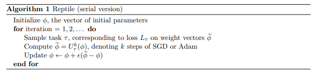

# Few-Shot Learning with Reptile
This code follows the tutorial on https://keras.io/examples/vision/reptile/.

The original paper is https://arxiv.org/abs/1803.02999.


## Overview
Reptile is a Meta-Learning algorithm, a family of algorithms for Few-Shot learning.
It is closely related to Model Agnostic Meta Learning (MAML) and First Order MAML (FOMAML).

## Meta Learning as Initialization
MAML solves an optimization problem that makes on additional assumption:

  - for a given task τ , the inner-loop optimization uses training samples A, whereas the loss is computed using test
samples B.



```
cur_meta_step_size = (1 - frac_done) * meta_step_size
old_vars = model.get_weights()
mini_dataset = train_dataset.get_mini_dataset(inner_batch_size, inner_iters, train_shots, classes)

for images, labels in mini_dataset:
    train_step(images, labels)

new_vars = model.get_weights()
for var in range(len(new_vars)):
    new_vars[var] = old_vars[var] + ((new_vars[var] - old_vars[var]) * cur_meta_step_size)
    
model.set_weights(new_vars)
```
    
