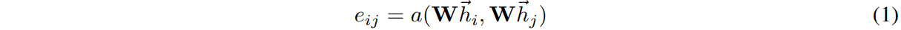
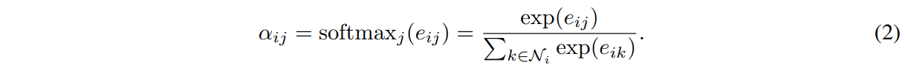

# Graph Attention Network (GAT) for Node Classification
This code follows the tutorial on https://keras.io/examples/graph/gat_node_classification/.

The original paper is https://arxiv.org/abs/1710.10903.

## Overview
Graph neural network finds relationships between nodes in a graph.
Graph attention network utilizes self attention layers to address shortcomings in graph convolutional network.

## Methods

e is the attention coefficient, i and j are respective nodes, W is linear transformation, and h is node features.
In the paper, masked attentions were applied with j being first order neighbors of i (including i).

attention coefficients are softmaxed for easy comparison.

