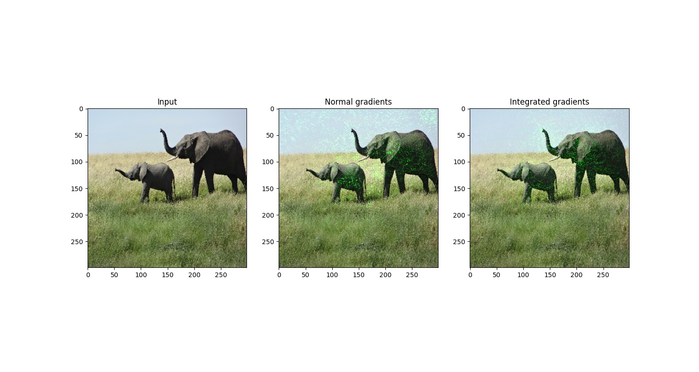
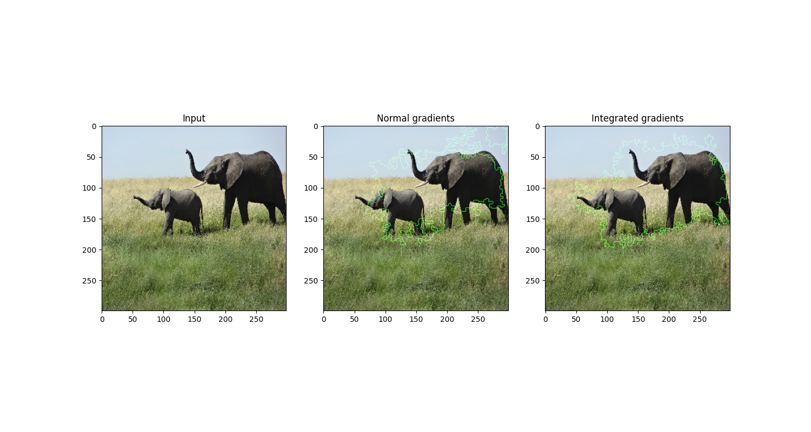
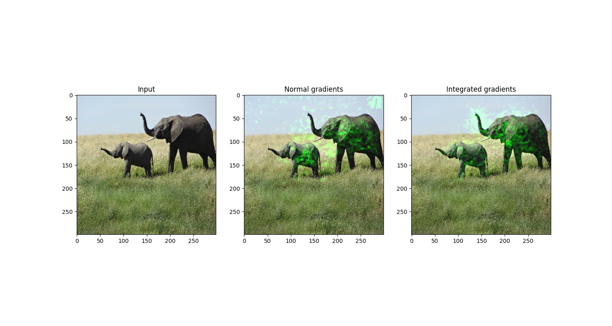

# Model Interpretability with Integrated Gradients
This code follows the tutorial on https://keras.io/examples/vision/integrated_gradients/.

The original paper is https://arxiv.org/abs/1703.01365.

The original code is https://github.com/ankurtaly/Integrated-Gradients.

Other methods noted in Stanford CS230, https://cs230.stanford.edu/lecture/,  are:

- Outputs:
    1. Saliency maps, https://arxiv.org/abs/1312.6034
    2. Occlusion sensitivity, https://arxiv.org/abs/1311.2901
    3. Class activation maps, https://openaccess.thecvf.com/content_cvpr_2016/papers/Zhou_Learning_Deep_Features_CVPR_2016_paper.pdf

- Inside:
    1. Gradient ascent with class model visualization
        - https://arxiv.org/abs/1312.6034
        - https://arxiv.org/abs/1312.6034
    2. Dataset search
    3. Deconvolution

## Overview
Integrated gradients is a technique for attributing a classifier's prediction to its input.

Given an input image and its classification, a baseline image (uniform intensity or random noise) is interpolated using the input image and forward passed through the classifier to compute the gradients.

The integral or gradients is approximated using the trapezoidal rule / Riemann sum.

Original Image:

Unclipped Gradients:

Clipped Gradients:

Cleaned Gradients:

