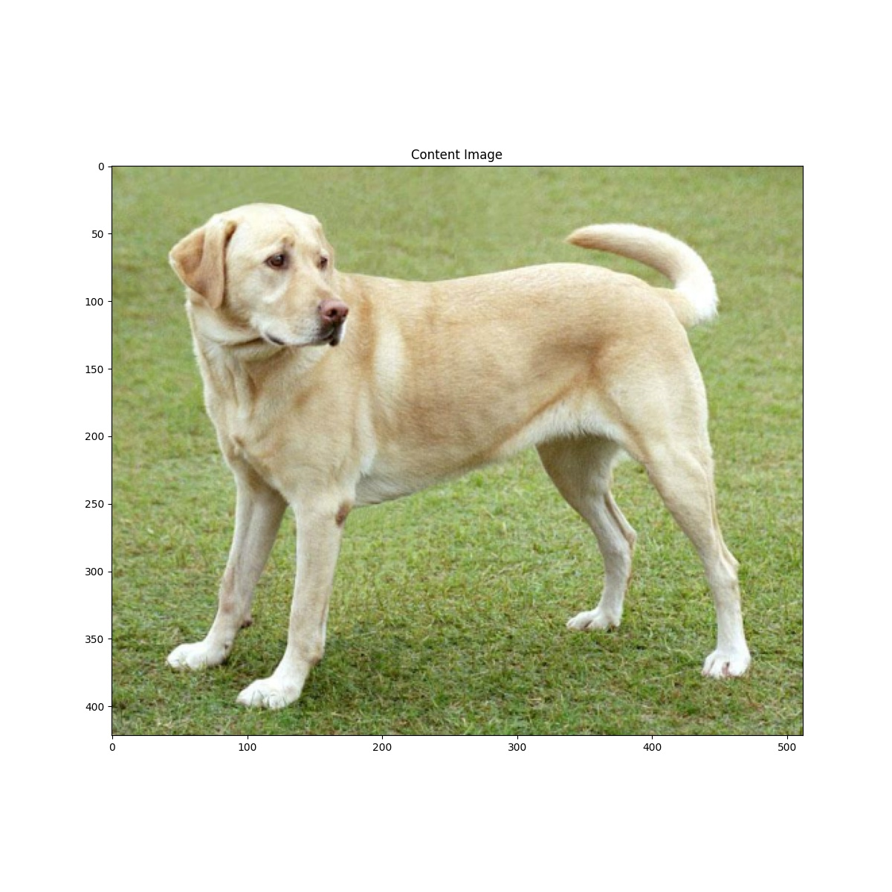
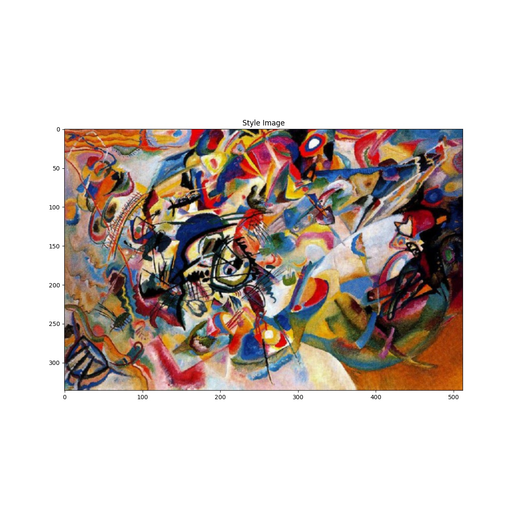
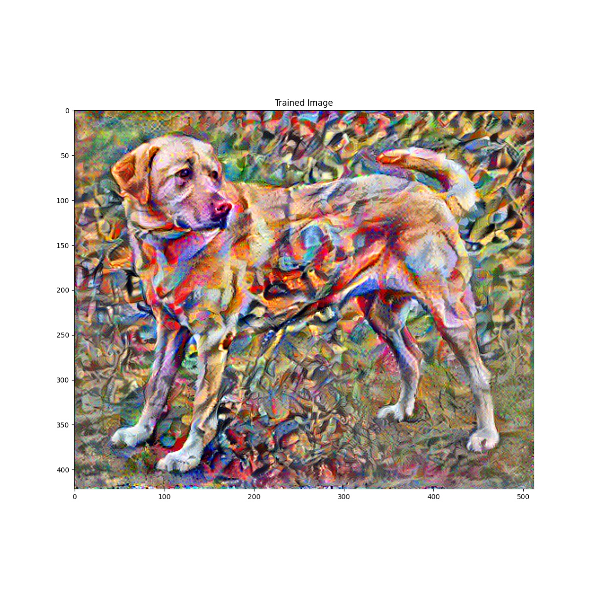
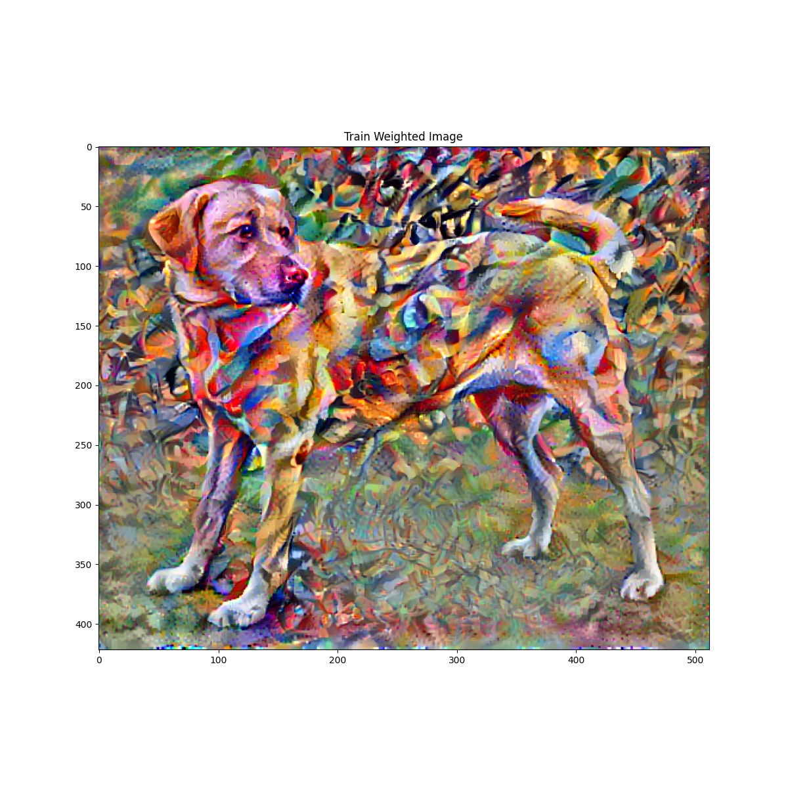

# Neural Style Transfer

This tutorial takes two images and extract content from one and style from the other and transfer the style to the content.

The original paper is here, https://arxiv.org/abs/1508.06576.

The original code is here, https://www.tensorflow.org/tutorials/generative/style_transfer.

## Feature Extraction

1. Load content and style image.



2. The code uses VGG19 with pre-trained weights on ImageNet as a feature extractor.
```
vgg = tf.keras.applications.VGG19(include_top=False, weights="imagenet")
```

3. The extractor is applied to the content and style images and extracts weighs from assigned layers.
```
style_targets = extractor(style_image)["style"]
content_targets = extractor(content_image)["content"]
```

4. The content of an image is represented by the values of the intermediate feature maps. The style of an image can be described by the means and correlations across the different feature maps using Gram Matrix.
```
style_outputs, content_outputs = (
    outputs[: self.num_style_layers], outputs[self.num_style_layers :],
)
style_outputs = [gram_matrix(style_output) for style_output in style_outputs]

def gram_matrix(input_tensor: tf.Tensor) -> tf.Tensor:
    result = tf.linalg.einsum("bijc,bijd->bcd", input_tensor, input_tensor)
    input_shape = tf.shape(input_tensor)
    num_locations = tf.cast(input_shape[1] * input_shape[2], tf.float32)
    return result / (num_locations)
```

5. For each training step, compute the style content loss and apply to the content image.
```
@tf.function()
def train_step(
    extractor: tf.keras.Model,
    image: tf.Tensor,
    style_targets: List,
    style_weight: float,
    content_targets: List,
    content_weight: float,
    opt: tf.optimizers,
):
    """Run one training step.

    Args:
        extractor (tf.keras.Model): model to extract features from.
        image (tf.Tensor): input image.
        style_targets (List): layers to extract style from.
        style_weight (float): weights of style to loss.
        content_targets (List): layers to extract content from.
        content_weight (float): weights of content to loss.
        opt (tf.optimizer): model optimizer.
    """
    with tf.GradientTape() as tape:
        outputs = extractor(image)
        loss = style_content_loss(
            outputs, style_targets, style_weight, content_targets, content_weight
        )

    grad = tape.gradient(loss, image) # dloss / dimage
    opt.apply_gradients([(grad, image)]) # [gradients, variables]
    image.assign(clip_0_1(image))

def style_content_loss(
    outputs: Dict,
    style_targets: List,
    style_weight: float,
    content_targets: List,
    content_weight: float,
) -> float:
    style_outputs = outputs["style"]
    content_outputs = outputs["content"]
    # Element wise add L2 loss between outputs and target.
    style_loss = tf.add_n(
        [
            tf.reduce_mean((style_outputs[name] - style_targets[name]) ** 2)
            for name in style_outputs.keys()
        ]
    )
    style_loss *= style_weight / len(style_outputs)

    # Element wise add L2 loss between outputs and target.
    content_loss = tf.add_n(
        [
            tf.reduce_mean((content_outputs[name] - content_targets[name]) ** 2)
            for name in content_outputs.keys()
        ]
    )
    content_loss *= content_weight / len(content_outputs)
    loss = style_loss + content_loss
    return loss
```


6. One downside to this basic implementation is that it produces a lot of high frequency artifacts. Decrease these using an explicit regularization term on the high frequency components of the image. In style transfer, this is often called the total variation loss.
```
@tf.function()
def train_step_weighted(
    extractor: tf.keras.Model,
    image: tf.Tensor,
    style_targets: List,
    style_weight: float,
    content_targets: List,
    content_weight: float,
    opt: tf.optimizers,
    total_variation_weight: float,
):
    """Ron one training step.

    Args:
        extractor (tf.keras.Model): model to extract features from.
        image (tf.Tensor): input image.
        style_targets (List): layers to extract style from.
        style_weight (float): weights of style to loss.
        content_targets (List): layers to extract content from.
        content_weight (float): weights of content to loss.
        opt (tf.optimizers): model optimizer.
        total_variation_weight (float): variation weight.
    """
    with tf.GradientTape() as tape:
        outputs = extractor(image)
        loss = style_content_loss(
            outputs, style_targets, style_weight, content_targets, content_weight
        )
        loss += total_variation_weight * tf.image.total_variation(image)

    grad = tape.gradient(loss, image)
    opt.apply_gradients([(grad, image)])
    image.assign(clip_0_1(image))
```

