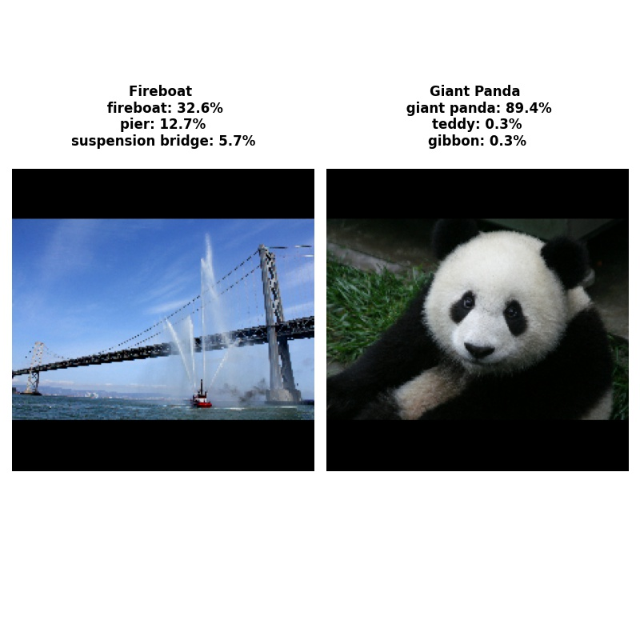
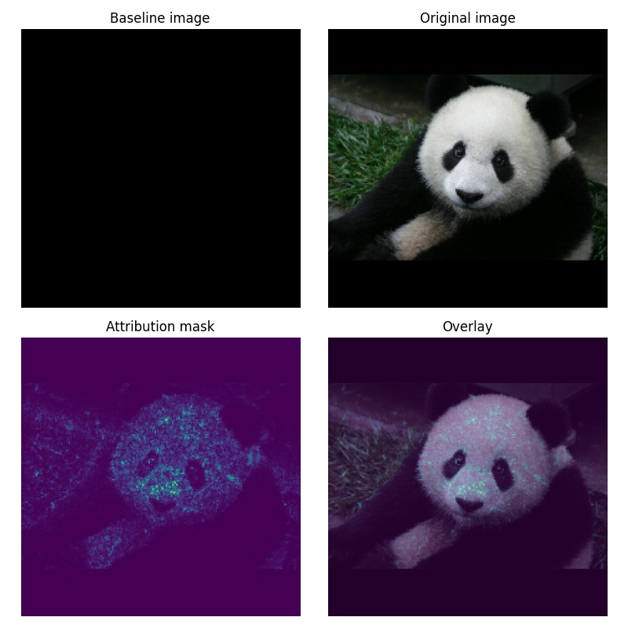

# Integrated Gradients

This tutorial takes computes and interpolates the gradients to show which pixels contributes the most.

This code re-implements the tutorial on https://www.tensorflow.org/tutorials/interpretability/integrated_gradients.

The original paper is https://arxiv.org/abs/1703.01365.

The original code is https://github.com/ankurtaly/Integrated-Gradients.

## Overview
Integrated gradients is a technique for attributing a classifier's prediction to its input.

Given an input image and its classification, a baseline image (uniform intensity or random noise) is interpolated using the input image and forward passed through the classifier to compute the gradients.

The integral or gradients is approximated using the trapezoidal rule / Riemann sum.

Original Image:

Classifications:

Baseline Image:

Interpolated Image:

Attributions:

## Notes from Tensorflow
- Use cases

    Employing techniques like Integrated Gradients before deploying your model can help you develop intuition for how and why it works. Do the features highlighted by this technique match your intuition? If not, that may be indicative of a bug in your model or dataset, or overfitting.

- Limitations

    Integrated Gradients provides feature importances on individual examples, however, it does not provide global feature importances across an entire dataset.

    Integrated Gradients provides individual feature importances, but it does not explain feature interactions and combinations
