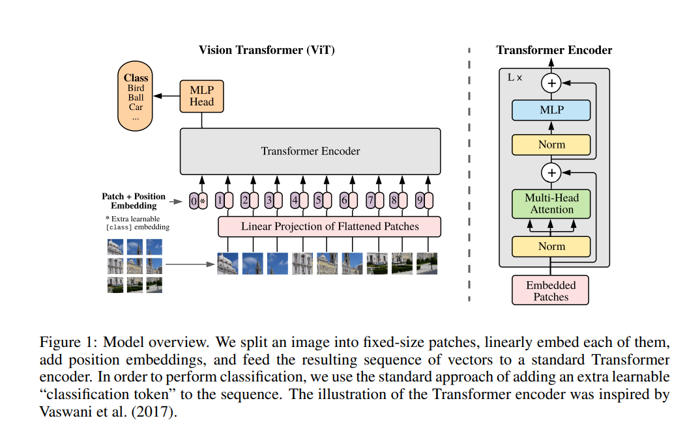

# Image Classification with Vision Transformer
This code follows the tutorial on https://keras.io/examples/vision/image_classification_with_vision_transformer.

## Overview
This tutorial trains a Vision Transformer to classify the CIFAR dataset.

The original paper is https://arxiv.org/pdf/2010.11929.pdf.

The orginal code is https://github.com/google-research/vision_transformer.


! Image snapshot from original paper.

## 3.1 Vision Transformer (ViT)
1. To handle 2D images, we reshape the image x ∈ R <sup>H×W×C</sup> into a sequence of flattened 2D patches x<sub>p</sub> ∈ R <sup>N×(P<sup>2</sup>C)</sup>, where (H, W) is the resolution of the original image, C is the number of channels, (P, P) is the resolution of each image patch, and N = HW/P<sup>2</sup> is the resulting number of patches, which also serves as the effective input sequence length for the Transformer.
```
class Patches(layers.Layer):
```
2. The Transformer uses constant latent vector size D through all of its layers, so we flatten the patches and map to D dimensions with a trainable linear projection (Eq. 1). We refer to the output of this projection as the patch embeddings.
```
class PatchEncoder(layers.Layer):
```
3. Similar to BERT’s class token, we prepend a learnable embedding to the sequence of embedded patches, whose state at the output of the Transformer encoder serves as the image representation y (Eq. 4).

- This part was not implemented in the code.
    Unlike the technique described in the paper, which prepends a learnable embedding to the sequence of encoded patches to serve as the image representation, all the outputs of the final Transformer block are reshaped with layers.Flatten() and used as the image representation input to the classifier head. Note that the layers.GlobalAveragePooling1D layer could also be used instead to aggregate the outputs of the Transformer block, especially when the number of patches and the projection dimensions are large.
```
representation = layers.Flatten()(representation)
representation = layers.Dropout(0.5)(representation)
features = mlp(representation, hidden_units=mlp_head_units, dropout_rate=0.5)
```
4. Both during pre-training and fine-tuning, a classification head is attached to z. The classification head is implemented by a MLP with one hidden layer at pre-training time and by a single linear layer at fine-tuning time.
```
def create_vit_classifier():
```
5. Position embeddings are added to the patch embeddings to retain positional information.
```
class PatchEncoder(layers.Layer):
```
5. The Transformer encoder consists of alternating layers of multiheaded self-attention and MLP blocks (Eq. 2, 3). Layernorm (LN) is applied before every block, and residual connections after every block.
```
def create_vit_classifier():
```
